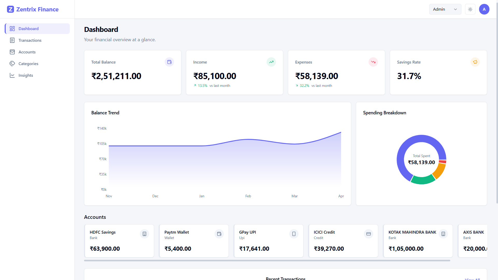
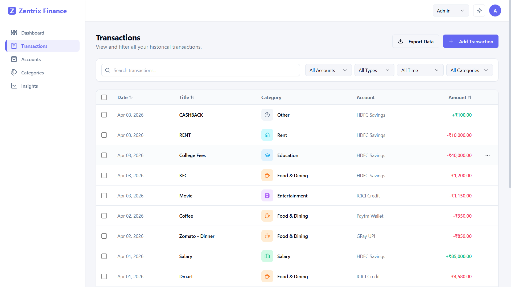
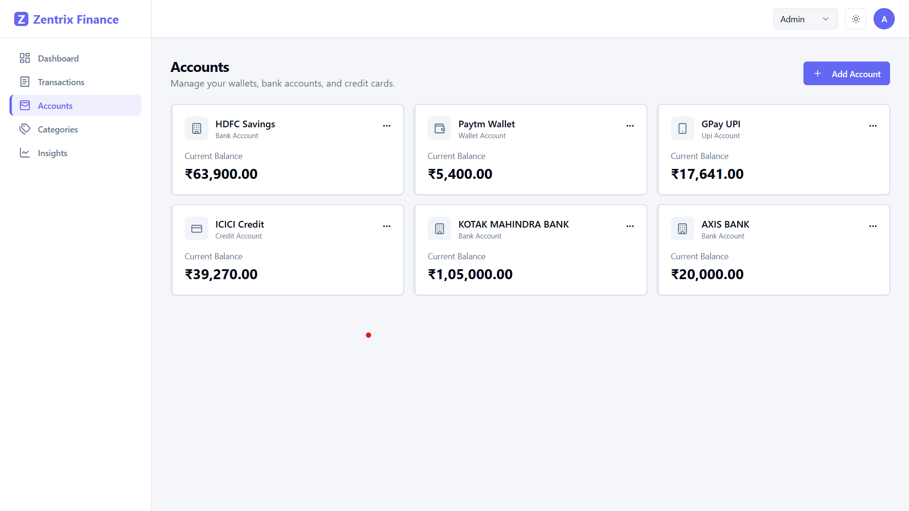
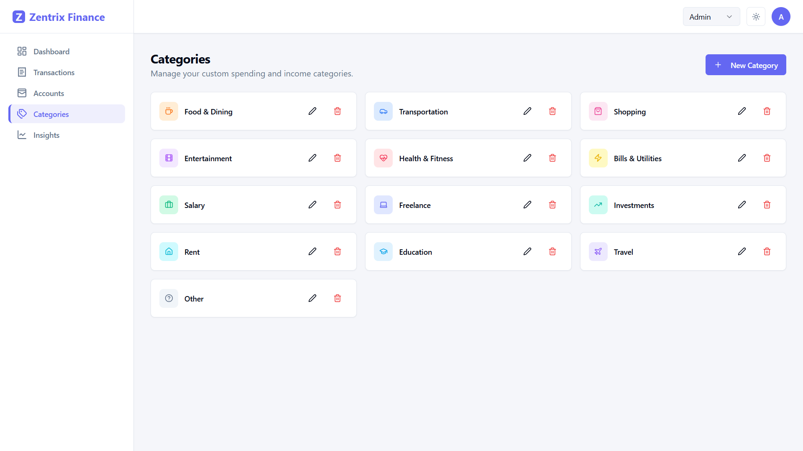
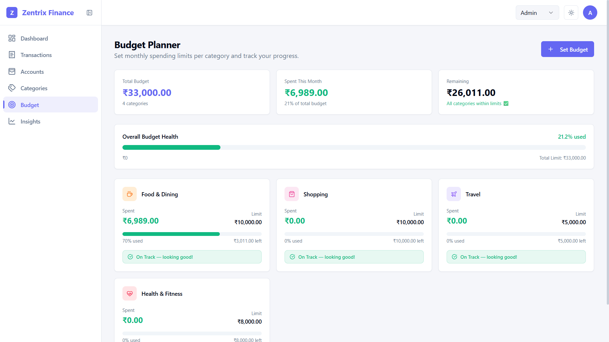
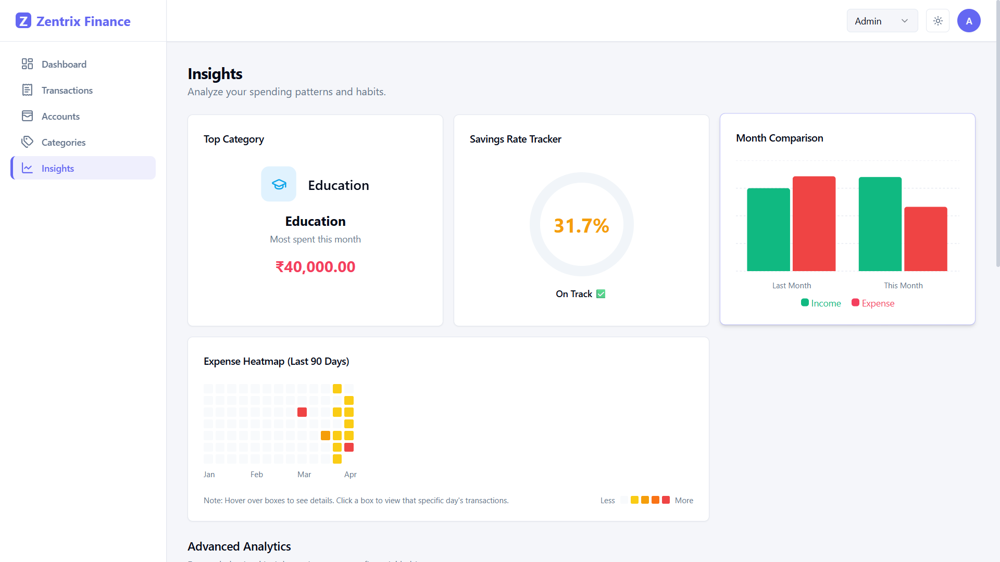
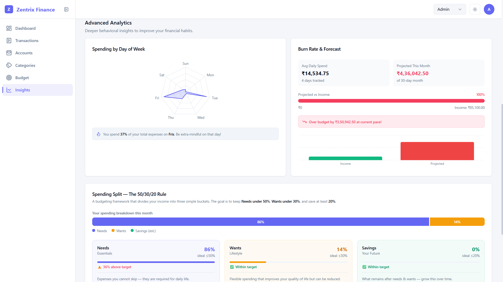

# 🏦 Zentrix Finance Dashboard

A modern, full-featured **personal finance management dashboard** built with React, TypeScript, and Tailwind CSS. Zentrix helps users track income and expenses, manage accounts, analyze spending patterns, and gain actionable financial insights — all in an elegant, dark-mode-first UI.

---

## 📋 Table of Contents

- [Overview](#-overview)
- [Tech Stack](#-tech-stack)
- [Setup & Installation](#%EF%B8%8F-setup--installation)
- [Project Structure](#-project-structure)
- [Features](#-features)
  - [Dashboard](#1-dashboard)
  - [Transactions](#2-transactions)
  - [Accounts](#3-accounts)
  - [Categories](#4-categories)
  - [Budget Planner](#5-budget-planner-)
  - [Insights & Analytics](#6-insights--analytics)
- [State Management Approach](#-state-management-approach)
- [Design System](#-design-system)
- [Role-Based Access](#-role-based-access)
- [Data Persistence](#-data-persistence)
- [Exporting Data](#-exporting-data)
- [Design Decision: Balance Immutability](#-design-decision-why-you-cant-change-an-accounts-balance-directly)

---

## 🌐 Overview

Zentrix Finance Dashboard is a SPA (Single Page Application) designed to help individuals monitor their complete financial picture. It provides:

- Real-time financial summaries (income, expenses, savings rate, account balances)
- Full transaction management with filtering, pagination, and export
- Multi-account support with balance tracking
- Deep spending analytics with behavioral insights
- Customizable spending categories
- Role-aware UI (Admin vs Viewer modes)

The application is entirely **client-side** — no backend or API is needed. All data is persisted to `localStorage` using Zustand's `persist` middleware, making it fully functional offline after initial load.

---

## 🛠 Tech Stack

| Layer | Technology |
|-------|-----------|
| **Framework** | React 19 + TypeScript 5.9 |
| **Build Tool** | Vite 8 |
| **Routing** | React Router DOM v7 |
| **Styling** | Tailwind CSS v3.4 + tailwindcss-animate |
| **State Management** | Zustand v5 (with `persist` middleware) |
| **UI Components** | Radix UI primitives (Dialog, Select, Dropdown, Switch, Tabs, Tooltip) |
| **Charts & Visualization** | Recharts v3 (BarChart, AreaChart, PieChart, RadarChart) |
| **Icons** | Lucide React |
| **Date Utilities** | date-fns v4 |
| **CSV Parsing / Export** | PapaParse v5 |
| **Toast Notifications** | Sonner v2 |
| **Utility** | clsx, tailwind-merge, class-variance-authority |

---

## ⚙️ Setup & Installation

### Prerequisites

- **Node.js** v18 or higher
- **npm** v9 or higher

### Steps

```bash
# 1. Clone the repository
git clone https://github.com/18-sumit/Finance-Dashboard-Assignment.git
cd Finance-Dashboard-Assignment

# 2. Install all dependencies
npm install

# 3. Start the development server
npm run dev
```

The app will be available at **http://localhost:5173** (or the next available port).

### Other Commands

```bash
# Type-check & build for production
npm run build

# Preview the production build locally
npm run preview

# Run ESLint
npm run lint
```

### Notes

- No `.env` file is required — the app has zero external API dependencies.
- On first launch, the app seeds itself with **mock transaction and account data** so you can explore all features immediately.
- All data changes persist automatically to your browser's `localStorage`.

---

## 📁 Project Structure

```
Finance-Dashboard-Assignment/
├── public/
├── src/
│   ├── components/
│   │   ├── accounts/
│   │   │   ├── AccountCard.tsx           # Single account display card
│   │   │   └── AccountModal.tsx          # Add/Edit account dialog
│   │   ├── dashboard/
│   │   │   ├── AccountBalances.tsx       # Horizontal scrollable account list
│   │   │   ├── BalanceTrendChart.tsx     # 6-month area chart
│   │   │   ├── BudgetSummaryWidget.tsx   # Compact budget health preview card
│   │   │   ├── RecentTransactions.tsx   # Last 5 transactions widget
│   │   │   ├── SpendingBreakdown.tsx    # Donut chart by category
│   │   │   └── SummaryCards.tsx         # KPI metric cards (balance, income, expense, savings)
│   │   ├── layout/
│   │   │   ├── Header.tsx               # Sticky top bar — theme, role, profile dropdown
│   │   │   ├── Layout.tsx               # Root layout — collapsible sidebar + main area
│   │   │   └── Sidebar.tsx              # Collapsible sidebar (icon-only ↔ full width)
│   │   └── ui/
│   │       ├── AmountBadge.tsx          # Color-coded amount display (+/-)
│   │       ├── CategoryIcon.tsx         # Dynamic icon + label from category store
│   │       ├── ConfirmDialog.tsx        # Reusable confirmation dialog
│   │       ├── EmptyState.tsx           # Zero-state UI with action CTA
│   │       ├── button.tsx               # Radix Slot-based button variants
│   │       ├── card.tsx                 # Card + CardHeader + CardContent
│   │       ├── dialog.tsx               # Radix Dialog wrapper
│   │       ├── dropdown-menu.tsx        # Radix DropdownMenu wrapper
│   │       └── select.tsx               # Radix Select wrapper
│   ├── hooks/
│   │   ├── useInsights.ts               # Aggregated financial metrics hook
│   │   └── useTransactions.ts           # Filtered + paginated transaction hook
│   ├── lib/
│   │   ├── categories.ts                # Default category definitions
│   │   ├── formatters.ts                # Currency & percentage formatters
│   │   ├── mockData.ts                  # Seed data (35 transactions across 4 accounts)
│   │   └── utils.ts                     # cn() utility (clsx + tailwind-merge)
│   ├── pages/
│   │   ├── AccountsPage.tsx             # Account management
│   │   ├── BudgetPage.tsx               # Budget planner — per-category monthly limits
│   │   ├── CategoriesPage.tsx           # Category management
│   │   ├── DashboardPage.tsx            # Overview with budget widget
│   │   ├── InsightsPage.tsx             # Analytics & behavioral insights
│   │   └── TransactionsPage.tsx         # Full transaction list with filter/pagination
│   ├── stores/
│   │   ├── accountStore.ts              # Account CRUD + balance management
│   │   ├── budgetStore.ts               #Per-category monthly budget limits (persisted)
│   │   ├── categoryStore.ts             # Category CRUD (persisted)
│   │   ├── filterStore.ts               # Global transaction filter state
│   │   ├── transactionStore.ts          # Transaction CRUD (persisted)
│   │   └── uiStore.ts                   # Theme, role, sidebar collapsed state
│   ├── types/
│   │   └── index.ts                     # TypeScript interfaces for core entities
│   ├── App.tsx                          # Router configuration
│   ├── main.tsx                         # React entry point
│   └── index.css                        # Global base styles + custom scrollbar
├── vercel.json                          # SPA rewrite rule for Vercel deployment
├── package.json
├── tailwind.config.js
├── tsconfig.json
└── vite.config.ts
```

---

## ✨ Features

### 1. Dashboard

**Route:** `/`

The command center of the app. Provides an immediate financial snapshot:

#### KPI Summary Cards
Four metric cards at the top display:
- **Total Balance** — Sum of all account balances
- **Income This Month** — Total income with % change vs last month
- **Expenses This Month** — Total expenses with % change vs last month  
- **Savings Rate** — `(Income - Expense) / Income × 100`

All cards feature subtle **hover lift animations** with a primary color border glow.

#### Balance Trend Chart
- **6-month area chart** using Recharts — shows cumulative balance movement over time
- Gradient fill below the line for a premium visual appearance
- Custom formatted Y-axis and tooltip

#### Spending Breakdown
- **Donut/Pie chart** breaking down this month's expenses by category
- Total spent displayed in the center
- Category names resolved from the dynamic category store

#### Account Balances Strip
- Horizontally scrollable card row showing all accounts
- Each account card features a **colored left border** matching the account's custom color
- Shows account name, type, and current balance

#### Recent Transactions
- Last **5 transactions** sorted by date (newest first)
- **3-column grid layout** — Category icon (left), Transaction title + date (center-aligned), Amount badge (right)
- **"View All"** link to the full Transactions page

---

### 2. Transactions

**Route:** `/transactions`

Full transaction ledger with advanced management capabilities.

#### Transaction List
- Displays transactions in paginated format — **15 per page**
- Each row shows: category icon, title, date, account, type badge, and amount
- Color-coded amounts: **green** for income, **red** for expenses

#### Filtering System
Multiple simultaneous filters:
- **Search** — fuzzy search by transaction title or date string
- **Category** — filter by specific spending category
- **Type** — All / Income / Expense / Transfer
- **Time Preset** — This Month / Last Month / Last 3 / 6 / 9 Months / 1 Year
- **Date Range** — Precise from/to date picker

All filters are managed via the global `filterStore` (Zustand), so filter state persists when navigating between pages and can be set programmatically (e.g., clicking a heatmap square on the Insights page redirects here with the date pre-filter applied).

#### Pagination
- 15 transactions per page
- Page navigation controls at the bottom
- Displays current page range (e.g., "Showing 1–15 of 48 transactions")

#### Add Transaction
- Full modal dialog with fields: Title, Amount, Type (Income/Expense/Transfer), Category, Account, Date, Notes
- On save, the linked account's balance updates **automatically**

#### Export to CSV / JSON *(Admin only)*
- Export button with a dropdown: **CSV** or **JSON**
- Exports **respect the currently active filters** — only filtered/visible transactions are exported
- CSV is formatted for spreadsheet use; JSON is pretty-printed

#### Bulk Delete *(Admin only)*
- Checkbox column appears for admin users
- Select individual rows or "Select All" on the current page
- Delete selected with a confirmation dialog

---

### 3. Accounts

**Route:** `/accounts`

Manage all your wallets, bank accounts, and credit cards.

#### Account Cards
- Grid of account cards — each shows: icon, name, type, current balance
- **Left-colored border** unique to each account for instant visual identification
- Balance updates **in real time** as transactions are added/edited/deleted

#### Add / Edit Account *(Admin only)*
- Modal with fields: Name, Type (Bank / Wallet / UPI / Credit / Savings), Starting Balance, Color, Icon
- Editing an account preserves transaction history

#### Delete Account *(Admin only)*
- Shows a **warning dialog** if the account has linked transactions
- Prevents accidental data loss

#### Empty State
- Friendly empty-state UI with a call-to-action shown when no accounts exist yet

---

### 4. Insights

**Route:** `/insights`

The most feature-rich page — 7 distinct analytical panels:

#### Top Category
- Highlights the **single category** where the user has spent the most this month
- Large centered icon, label, and total amount

#### Savings Rate Tracker
- Circular ring visualization displaying this month's savings rate
- Status message: *"On Track ✅"* or *"Needs attention ⚠️"*

#### Month Comparison Bar Chart
- Side-by-side bars comparing **last month vs this month** income and expenses

#### Expense Heatmap *(90 Days)*
- GitHub-style contribution heatmap (7 rows × ~13 columns grid)
- Each cell represents one day; color intensity reflects spending magnitude
  - ⬜ No spend → 🟡 Low → 🟠 Medium → 🔴 High
- **Hover tooltip** shows: Date, Total Spent, Transaction Count
- **Click** any cell to instantly jump to Transactions page with that date pre-filtered
- Month labels positioned below matching their column

#### 🆕 Day of Week Spending Radar
- **Radar (spider-web) chart** plotting average spend across Mon–Sun
- Identifies the user's most expensive day of the week
- Dynamic callout: *"You spend 42% of your weekly budget on Saturdays. Be mindful this Saturday!"*

#### 🆕 Burn Rate & Forecast
- Calculates **Average Daily Spend** from month start to today
- Projects total spend if the current rate continues to month end
- **Animated progress bar** with dynamic color:
  - 🟢 Green: projected < 80% of income
  - 🟡 Amber: projected 80–100% of income
  - 🔴 Red: projected > 100% of income (over budget)
- Companion bar chart comparing Income vs Projected Spend
- Smart status message: plaintext forecast explanation

#### 🆕 Needs vs Wants — 50/30/20 Rule Analysis
- Classifies all this month's expenses into:
  - **Needs (Fixed):** Rent, health, utilities, insurance, groceries, education, EMIs
  - **Wants (Variable):** Entertainment, dining out, shopping, travel, subscriptions
- **Horizontal stacked bar** showing the visual ratio split
- Two detail cards with mini progress bars and ideal-vs-actual check indicators (✅/⚠️)
- Educational callout explaining the 50/30/20 rule for financial literacy

---

### 5. Categories

**Route:** `/categories`

Manage the taxonomy of your spending.

#### Category Cards
- Grid of all categories — each shows the icon and label
- Subtle **hover lift + border glow animation** on mouse-over

#### Add / Edit Category *(Admin only)*
- Modal with fields: Name, Icon (from 20+ Lucide icon options), Color (10 vibrant presets)
- Category IDs are auto-generated from the label name

#### Delete Category *(Admin only)*
- Removes the category from the store

> **Note:** Default categories (Food & Dining, Transportation, Entertainment, Health, Shopping, etc.) are seeded from `src/lib/categories.ts` and stored in the persisted `categoryStore`.

---

### 5. Budget Planner 🎯

**Route:** `/budget`

The Budget Planner lets users set **monthly spending limits per category** and tracks real-time progress against those limits. This is one of the most impactful features for personal finance discipline.

#### How It Works
For each spending category, an Admin sets a monthly cap (e.g., ₹5,000 for Food). The app then automatically compares all this month's actual expenses in that category against the cap — updating in real time as new transactions are added.

#### Budget Summary Cards
Three KPI cards at the top of the page:
- **Total Budget** — Sum of all category limits set for the month
- **Spent This Month** — Total actual spending across budgeted categories
- **Remaining** — Budget remaining, with a warning count if any categories are over-limit

#### Overall Budget Health Bar
A single master progress bar showing total spend as a % of total budget:
- 🟢 **Green** — Under 80% utilized
- 🟡 **Amber** — 80–99% utilized (approaching limit)
- 🔴 **Red** — 100%+ (over budget)

#### Per-Category Budget Cards
Each budget entry gets its own card showing:
- **Category name & icon** (resolved from the category store)
- **Amount spent** (color-coded by status — green/amber/red)
- **Monthly limit set by admin**
- **Animated progress bar** transitioning green → amber → red
- **Percentage used** and **amount remaining or over**
- **Status badge** — *"On Track"*, *"Warning — nearing limit"*, or *"Over Budget — over by ₹X"*
- **Edit / Delete buttons** on hover (Admin only)

#### Set / Edit Budget Modal *(Admin only)*
- Select any unbudgeted category from an auto-filtered dropdown (already-budgeted ones are excluded)
- Enter the monthly limit in ₹
- **Live preview bar** — shows the current month's spend vs the new limit before confirming
- Inline color-coded status updates as you type the limit amount

#### Dashboard Budget Widget
A compact **"Budget Overview"** card lives on the Dashboard page alongside Recent Transactions. It shows the top 5 highest-burn categories with mini progress bars and a direct **"Manage →"** link to the Budget page.

#### Empty State
When no budgets are set yet, a friendly zero-state screen is displayed with a Target icon and a call-to-action button: *"Set Your First Budget"*.

#### Data Model
```ts
interface Budget {
  categoryId: string;  // Links to an existing category in the categoryStore
  limit: number;       // Monthly spending cap in ₹
}
```
Stored in `budgetStore` (`src/stores/budgetStore.ts`) and persisted to `localStorage` under the key `finance-budget-storage`.

---

### 6. Insights & Analytics

**Route:** `/insights`

The most feature-rich page — 7 distinct analytical panels:

#### Top Category
- Highlights the **single category** where the user has spent the most this month
- Large centered icon, label, and total amount

#### Savings Rate Tracker
- Circular ring visualization displaying this month's savings rate
- Status message: *"On Track ✅"* or *"Needs attention ⚠️"*

#### Month Comparison Bar Chart
- Side-by-side bars comparing **last month vs this month** income and expenses

#### Expense Heatmap *(90 Days)*
- GitHub-style contribution heatmap (7 rows × ~13 columns)
- Color intensity reflects daily spending magnitude (⬜ none → 🟡 low → 🟠 medium → 🔴 high)
- **Hover tooltip** shows: Date, Total Spent, Transaction Count
- **Click** any cell to jump to Transactions with that date pre-filtered

#### 🆕 Day of Week Spending Radar
- **Radar chart** plotting spend across Mon–Sun
- Identifies the most expensive day of the week
- Callout: *"You spend 42% of your total expenses on Saturdays. Be extra mindful on that day!"*

#### 🆕 Burn Rate & Forecast
- Calculates **Average Daily Spend** from month start to today
- Projects total spend at current rate to end of month
- **Animated progress bar** — green / amber / red based on projected vs income
- Companion bar chart comparing Income vs Projected Spend

#### 🆕 Spending Split — 50/30/20 Rule
- Classifies expenses into **Needs** (rent, health, utilities), **Wants** (dining, shopping, entertainment), and estimates **Savings** bucket
- Three dedicated cards per bucket: your%, ideal%, mini progress bar, ✅/⚠️ status, examples, and description in plain language
- **"What does this mean for you?"** panel explains the rule in conversational, jargon-free language

---

## 🧠 State Management Approach

The app uses **Zustand** — a lightweight, zero-boilerplate state management library. There are **6 stores**:

| Store | Purpose | Persisted |
|-------|---------|-----------|
| `transactionStore` | Transaction CRUD + account balance sync | ✅ localStorage |
| `accountStore` | Account CRUD + balance update method | ✅ localStorage |
| `categoryStore` | Category CRUD with default seed | ✅ localStorage |
| `budgetStore` | Per-category monthly spending limits | ✅ localStorage |
| `filterStore` | Active filter state (search, type, category, date preset, date range) | ❌ Session only |
| `uiStore` | Theme (dark/light), Role (admin/viewer), Sidebar collapsed state | ✅ localStorage |

### Cross-Store Balance Sync
When a transaction is added, edited, or deleted, `transactionStore` directly calls `accountStore.getState().updateBalance()` to keep account balances accurate without needing React context waterfalls or prop drilling.

### Computed Data via Hooks
Complex derived values are calculated in custom hooks (`useInsights`, `useTransactions`) using `useMemo` — these return computed aggregates from raw store data, keeping business logic separate from UI components.

---

## 🎨 Design System

The UI follows a **dark-mode-first** design with a cohesive token system:

### Color Tokens (HSL CSS Variables)
Defined in `index.css` and consumed via Tailwind's `hsl(var(--...))` pattern:
- `--background`, `--foreground`
- `--card`, `--card-foreground`
- `--primary`, `--primary-foreground`
- `--muted`, `--muted-foreground`
- `--border`, `--input`
- `--destructive`

### Scrollbar Styling
Custom webkit scrollbar styles in `index.css` match the dark theme — thin, subtle, and adapts between dark/light.

### Card Hover Effect (Global Pattern)
All cards across the app share a consistent hover animation:
```
hover:shadow-md hover:-translate-y-0.5 transition-all duration-200 hover:border-primary/40
```
This produces a slight lift + shadow deepening + subtle brand border glow on hover.

### Typography
Uses system font stack with Tailwind's `tracking-tight` for headings and `tabular-nums` for all financial figures (ensures columns align properly).

---

## 🔐 Role-Based Access

The app supports two roles, toggled from the Header:

| Feature | Admin | Viewer |
|---------|-------|--------|
| View all pages & data | ✅ | ✅ |
| Add transactions | ✅ | ❌ |
| Edit transactions | ✅ | ❌ |
| Delete transactions | ✅ | ❌ |
| Bulk delete transactions | ✅ | ❌ |
| Export CSV / JSON | ✅ | ❌ |
| Add/Edit/Delete accounts | ✅ | ❌ |
| Add/Edit/Delete categories | ✅ | ❌ |
| Set/Edit/Delete budgets | ✅ | ❌ |
| View budget progress | ✅ | ✅ |

Role state is stored in `uiStore` and persisted — the UI dynamically shows/hides action buttons, modals, and interactive features based on the active role.

---

## 💾 Data Persistence

All core data persists to `localStorage` via Zustand `persist` middleware:

| Key | Contents |
|-----|---------|
| `finance-transaction-storage` | All transaction records |
| `finance-account-storage` | All account records + balances |
| `finance-category-storage` | All custom and default categories |
| `finance-budget-storage` | All per-category monthly budget limits |
| `finance-ui-storage` | Theme preference, active role, sidebar collapsed state |

**To reset all data** to factory mock data, use the "Reset to Mock Data" button (Admin only) which calls `transactionStore.resetAll()`.

---

## 📤 Exporting Data

Available on the **Transactions** page for Admin users:

### CSV Export
- Compatible with Excel, Google Sheets, Numbers
- Columns: ID, Date, Title, Amount, Type, Category, Account ID, Notes
- Filters applied — only the currently visible/filtered set is exported

### JSON Export
- Pretty-printed JSON array
- Full transaction objects including all fields
- Same filter-awareness as CSV export

Both exports trigger an automatic browser download with a timestamped filename.

---

## 🔒 Design Decision: Why You Can't Change an Account's Balance Directly

This is an intentional architectural decision rooted in **financial data integrity**, and it's worth understanding clearly.

### How Account Balance Works

When you create an account, you set an **Opening Balance** — this is treated as a fixed starting point, essentially representing the account's value on the day you started tracking it in the app.

After that, the account's `balance` field in the store is **never set to a fixed number directly by the user**. Instead, it evolves exclusively through the `updateBalance(id, amountChange)` method, which only ever **adds or subtracts a delta**:

```ts
// In accountStore.ts
updateBalance: (id, amountChange) =>
  set((state) => ({
    accounts: state.accounts.map((a) =>
      a.id === id ? { ...a, balance: a.balance + amountChange } : a
    )
  }))
```

This method is called automatically by `transactionStore` every time a transaction is:
- **Added** → balance increases (income) or decreases (expense)
- **Edited** → old effect is reversed, new effect is applied
- **Deleted** → effect is reversed to restore the prior balance

### Why Not Allow Direct Editing of the Balance?

If a user could type any arbitrary number into the balance field of an existing account, it would create a **silent data gap**:

> The account shows ₹50,000 — but the transaction history only accounts for ₹32,000. Where did the extra ₹18,000 come from? There's no record.

This breaks the **core audit trail** of a finance app. Every rupee in your balance should be traceable back to a transaction entry. Allowing a direct balance override would make the Insights page, Spending Charts, and Savings Rate calculations **unreliable** because they are all derived from actual transaction data — not the balance number stored on the account.

### The Correct Way to "Adjust" a Balance

If a user's real-world account balance differs from what the app shows (e.g., they forgot to log some old transactions), the right approach is to **add a corrective transaction** — for example:

> **Title:** "Balance Adjustment"  
> **Type:** Income (or Expense)  
> **Amount:** The difference  
> **Category:** Miscellaneous

This keeps the ledger truthful and auditable, just like how real accounting systems handle adjustments via journal entries rather than direct number edits.

### Why the Account Modal Allows Editing Other Fields

The Edit Account modal lets you change the account's **Name, Type, Color, and Icon** — because these are purely cosmetic/metadata changes that have zero impact on financial calculations. Only the `balance` field is protected from direct user manipulation post-creation.

---

## 🖼 Screenshots





 



---

## 📄 License

This project was built for **evaluation and demonstration purposes**. Feel free to extend and adapt it for personal or commercial use.

---

*Built with ❤️ using React, TypeScript, and Tailwind CSS.*
